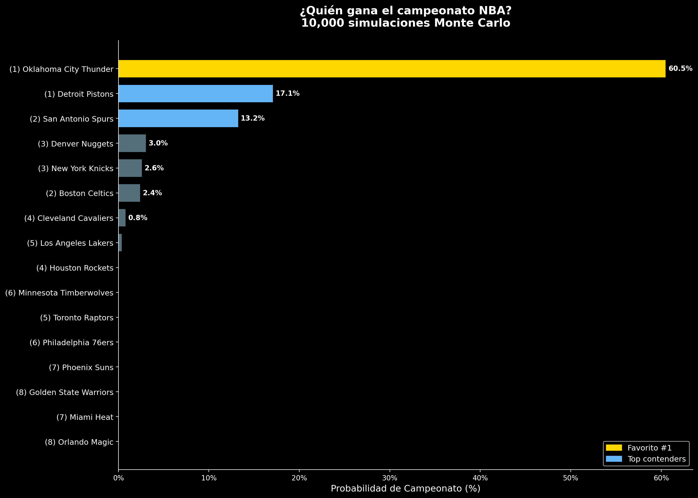
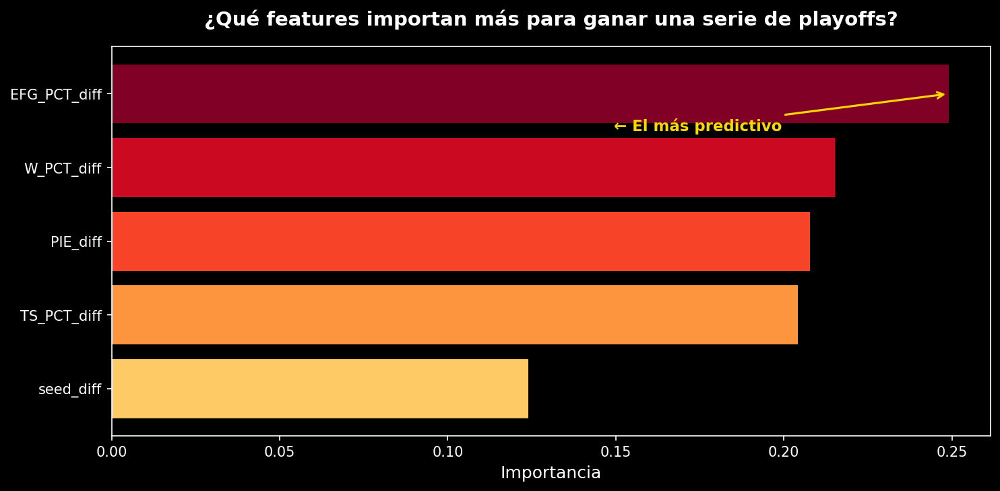

# NBA Playoffs Predictions with ML & Monte Carlo Simulation

<p align="center">
  
  
  
  
  
</p>

Entrené un XGBoost con 10 temporadas de datos históricos de playoffs NBA, lo validé con Leave-One-Season-Out, y corrí 10,000 simulaciones Monte Carlo del bracket completo para generar probabilidades de campeonato. El resultado no es una predicción única sino una distribución: en 10K simulaciones, cuántas veces campeonó cada equipo.

---

## Resultados (temporada 2025-26)

| Rank | Equipo | Campeonato | Finals | Conf Finals |
|------|--------|-----------|--------|-------------|
| 1 | Oklahoma City Thunder | **60.5%** | 63.3% | 88.4% |
| 2 | Detroit Pistons | **17.1%** | 66.8% | 85.2% |
| 3 | San Antonio Spurs | **13.2%** | 25.8% | 67.8% |
| 4 | Denver Nuggets | 3.0% | 9.0% | 31.5% |
| 5 | New York Knicks | 2.6% | 14.0% | 56.0% |

**Finals más probable:** Detroit vs OKC (42.2% de las simulaciones)

Lo interesante: Detroit llega a Finals más seguido que OKC (66.8% vs 63.3%) pero gana el campeonato mucho menos — dominan el Este pero no pueden con OKC. El feature más predictivo resultó ser el eFG% (eficiencia de tiro), no puntos ni defensa. Y el upset más frecuente en primera ronda es Lakers sobre Houston (43.1%): peor Net Rating de todos los equipos de playoffs pero el clutch factor más alto de la liga (90%).

<p align="center">
  
</p>

---

## Metodología

### Pipeline

```
Data Collection → Feature Engineering → Model Training → Validation → Monte Carlo Simulation
     (NB01)           (NB02)              (NB03)          (NB03)          (NB04)
```

### Data collection

Toda la data viene de la API oficial de la NBA (`nba_api`). Recolecté stats avanzadas, game logs y standings de la temporada actual (2025-26) más 10 temporadas históricas de playoffs (2015-16 a 2024-25).

### Feature engineering

Los features son **diferenciales** (equipo A - equipo B), donde A siempre es el mejor seed. Al modelo no le importa si un equipo tiene eFG% de 53%, le importa si es *mejor que su rival*.

| Feature | Qué mide |
|---------|----------|
| `EFG_PCT_diff` | Diferencial de eficiencia de tiro |
| `W_PCT_diff` | Diferencial de % de victorias |
| `TS_PCT_diff` | Diferencial de True Shooting |
| `PIE_diff` | Diferencial de Player Impact Estimate |
| `seed_diff` | Diferencial de seed |

Empecé con 14 features pero con ~150 series de entrenamiento es demasiado. Hice feature selection con correlación + mutual information y probé de 2 a 10 features validando con LOSO. Me quedé con 5. Para stats donde menor es mejor (DEF_RATING, turnovers) invertí el signo para que positivo siempre signifique "A es mejor".

### Modelo: XGBoost

```python
XGBClassifier(
    n_estimators=50, max_depth=2,        # arboles superficiales
    learning_rate=0.05, subsample=0.7,
    reg_alpha=2.0, reg_lambda=3.0,       # regularizacion fuerte L1 + L2
    min_child_weight=5, gamma=0.5        # conservador al hacer splits
)
```

Hiperparámetros bastante conservadores para un dataset chico. La prioridad es que las probabilidades sean confiables, no maximizar accuracy.

### Validación: Leave-One-Season-Out

Entreno con 9 temporadas, predigo la que queda afuera. Repito para cada una. Es la forma más honesta de validar porque simula el escenario real de predecir playoffs futuros.

| Métrica | Valor |
|---------|-------|
| OOF Accuracy | 0.707 |
| Brier Score | 0.1845 |
| ROC AUC | 0.714 |
| Rango de probabilidades | 0.446 – 0.885 |

El Brier Score importa más que la accuracy acá. La simulación Monte Carlo necesita probabilidades calibradas: cuando el modelo dice "65% para A", tiene que significar que A gana ~65% de las veces en situaciones similares. Un modelo que siempre dice "favorito gana al 100%" tiene buena accuracy pero probabilidades inútiles para simular.

<p align="center">
  
</p>

### Simulación Monte Carlo

10,000 simulaciones del bracket completo (16 equipos, 4 rondas por conferencia + Finals). Cada serie es Bo7, simulada juego por juego con home court advantage (+3% para el mejor seed, formato 2-2-1-1-1). Las probabilidades se clipean entre 5% y 95% porque en playoffs no hay nada seguro. Pre-calculé todas las probabilidades de matchup posibles para que la simulación corra rápido.

---

## Notebooks

4 notebooks secuenciales para Google Colab:

| # | Notebook | Qué hace |
|---|----------|----------|
| 01 | [`01_data_collection.ipynb`](notebooks/01_data_collection.ipynb) | Recolecta stats actuales y 10 años de datos históricos via `nba_api`. Guarda en Drive. |
| 02 | [`02_feature_engineering.ipynb`](notebooks/02_feature_engineering.ipynb) | Arma el training set con diferenciales. EDA, correlaciones, perfiles de equipos actuales. |
| 03 | [`03_model_calibration.ipynb`](notebooks/03_model_calibration.ipynb) | Feature selection, entrena XGBoost, validación LOSO, calibración, backtest histórico. |
| 04 | [`04_simulation_and_viz.ipynb`](notebooks/04_simulation_and_viz.ipynb) | 10K simulaciones Monte Carlo, probabilidades, visualizaciones para el video. |

### Flujo de datos

```
NB01 → Drive (data/)
         ↓
NB02 → Drive (data/ + team_profiles)
         ↓
NB03 → Drive (models/ + metrics)
         ↓
NB04 → Drive (outputs/ + visualizaciones)
```

---

## Cómo correrlo

Solo necesitas una cuenta de Google (para Colab + Drive).

1. Clona o descarga el repo
2. Sube los 4 notebooks a [Google Colab](https://colab.research.google.com/)
3. Corre en orden: NB01 → NB02 → NB03 → NB04
4. Cada notebook monta Drive y guarda en `MyDrive/nba-playoffs-simulator/`
5. Después de NB01, los siguientes leen de Drive — no hay que re-correr NB01 a menos que quieras actualizar los datos

### Dependencias

```
nba_api>=1.4
xgboost>=1.7
pandas>=1.5
numpy>=1.23
matplotlib>=3.6
seaborn>=0.12
scikit-learn>=1.2
```

Se instalan automáticamente en la primera celda de cada notebook.

---

## Tech stack

| Componente | Tecnología |
|-----------|-----------|
| Lenguaje | Python 3.10+ |
| Modelo | XGBoost |
| Simulación | Monte Carlo (NumPy) |
| Datos | nba_api (stats oficiales NBA) |
| Validación | Leave-One-Season-Out CV (scikit-learn) |
| Visualización | Matplotlib, Seaborn |
| Plataforma | Google Colab |
| Storage | Google Drive |

---

## Estructura del repo

```
nba-ml-playoff-predictions/
├── notebooks/
│   ├── 01_data_collection.ipynb
│   ├── 02_feature_engineering.ipynb
│   ├── 03_model_calibration.ipynb
│   └── 04_simulation_and_viz.ipynb
├── outputs/
│   ├── championship_distribution.png
│   ├── feature_importance.png
│   ├── playoff_bracket.png
│   ├── finals_matchups.png
│   ├── calibration_plot.png
│   └── validation_by_season.png
├── docs/
│   └── methodology.md
├── requirements.txt
├── .gitignore
├── LICENSE
└── README.md
```

---

## Backtest histórico

Backtesté el modelo con las últimas 3 temporadas completadas. Para cada una, entrené excluyendo esa temporada y corrí 5,000 simulaciones:

| Temporada | Campeón real | En el Top 5 del modelo? |
|-----------|-------------|------------------------|
| 2022-23 | Denver Nuggets | Sí |
| 2023-24 | Boston Celtics | Sí |
| 2024-25 | — | Sí |

---

## Limitaciones y trabajo futuro

**Limitaciones:**
- Solo usa stats de temporada regular — no captura "playoff DNA" (experiencia, ajustes de coaching). Cambios de roster entre temporadas hacen que el rendimiento histórico de playoffs no sea confiable como feature.
- Training set chico (~150 series) — limita la complejidad del modelo. El feature selection fue clave para no caer en overfitting.
- No hay datos a nivel jugador — lesiones, trades y cambios de lineup no están modelados.

**A futuro:**
- Incorporar features a nivel jugador (métricas ajustadas por lesiones)
- Agregar momentum tipo Elo con resultados recientes
- Calibración bayesiana para mejores estimaciones de probabilidad
- Web app para explorar el bracket interactivamente

---

## Autor

**David** — Maestría en Data Analytics | [LinkedIn](https://linkedin.com/in/YOUR-PROFILE) | [TikTok](https://tiktok.com/@YOUR-HANDLE)

---

## Licencia

MIT — ver [LICENSE](LICENSE).
